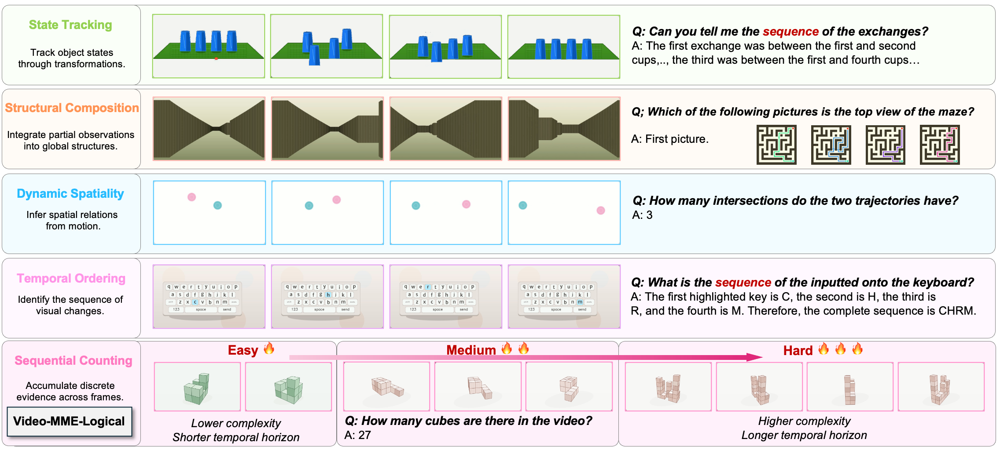
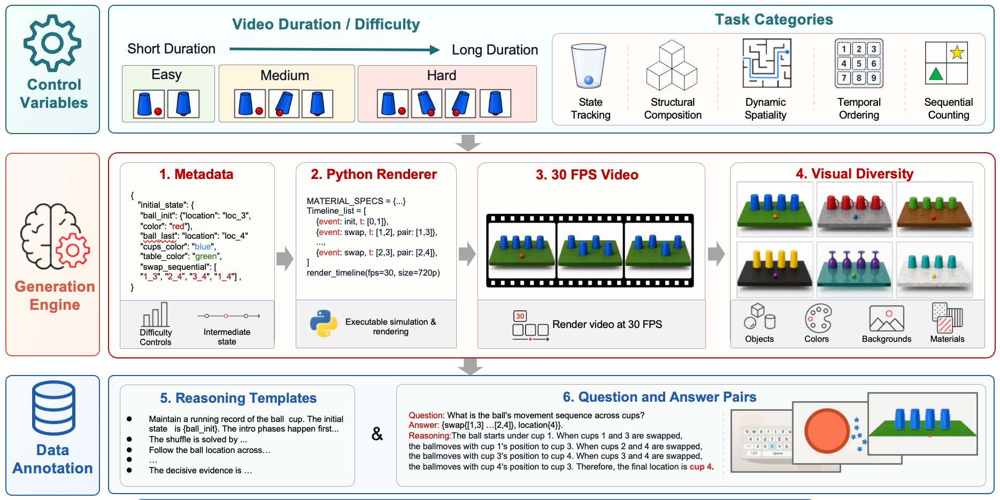

# Video-MME-Logical

**Video-MME-Logical: A Controlled Diagnostic Benchmark for Video Temporal-Logical Reasoning**

This is the official open-source entry for Video-MME-Logical. The current repository hosts the project page and release landing materials. Code, dataset release instructions, and evaluation scripts are being organized and will be released here.

## Links

[🍎 Project Page](https://mrakas.github.io/video-mme-logical/) [📖 Paper](https://arxiv.org/pdf/2606.27828) [🏆 Leaderboard](#-leaderboard) [📊 Dataset](https://huggingface.co/datasets/marcuskwan/video-mme-logical)

## 🏆 Leaderboard

Scores are accuracy (%) from the paper. The tables below omit our trained/SFT models and report the compact overall difficulty breakdown.

### Video-MME-Logical

| Model | Overall | Easy | Medium | Hard |
|---|---:|---:|---:|---:|
| Human Level | 95.9 | 98.4 | 95.9 | 93.4 |
| **Open-source Instruct Models** |  |  |  |  |
| Qwen3-VL-8B-Instruct | 11.9 | 13.4 | 12.8 | 9.6 |
| Qwen3-VL-30B-A3B-Instruct | 11.8 | 14.5 | 12.4 | 8.7 |
| Qwen3-Omni-30B-A3B-Instruct | 5.8 | 6.3 | 6.1 | 4.9 |
| Qwen2.5-VL-3B-Instruct | 1.9 | 3.1 | 1.5 | 1.3 |
| Qwen2.5-VL-7B-Instruct | 7.4 | 10.3 | 7.7 | 4.3 |
| Qwen2.5-VL-72B-Instruct | 12.5 | 15.2 | 13.1 | 9.1 |
| InternVL3.5-8B-Instruct | 12.1 | 13.8 | 13.5 | 8.9 |
| InternVL3.5-30B-A3B-Instruct | 8.7 | 9.5 | 9.7 | 7.0 |
| LLaVA-Video-7B-Qwen2 | 0.0 | 0.1 | 0.0 | 0.0 |
| LLaVA-Video-72B-Qwen2 | 2.4 | 4.7 | 1.9 | 0.7 |
| KimiVL-16B-A3B-Instruct | 2.9 | 5.4 | 2.2 | 0.9 |
| **Open-source Thinking Models** |  |  |  |  |
| Qwen3-VL-8B-Think | 6.6 | 7.9 | 5.8 | 6.0 |
| Qwen3-VL-30B-A3B-Think | 10.3 | 16.0 | 8.7 | 6.1 |
| Qwen3-Omni-30B-A3B-Think | 6.2 | 6.6 | 5.2 | 6.8 |
| KimiVL-16B-A3B-Think | 7.6 | 10.2 | 6.8 | 5.8 |
| **Proprietary Models** |  |  |  |  |
| GPT-5.4 | 22.7 | 31.7 | 20.3 | 16.1 |
| Gemini-3.1 Pro | **28.6** | **33.1** | **24.1** | **20.6** |

### Video-MME-Logical-S

| Model | Overall | Easy | Medium | Hard |
|---|---:|---:|---:|---:|
| Human Level | 96.1 | 98.5 | 96.0 | 93.8 |
| **Open-source Instruct Models** |  |  |  |  |
| Qwen3-VL-8B-Instruct | 0.0 | 0.0 | 0.0 | 0.0 |
| Qwen3-VL-30B-A3B-Instruct | 0.1 | 0.3 | 0.0 | 0.0 |
| Qwen3-Omni-30B-A3B-Instruct | 0.0 | 0.0 | 0.0 | 0.0 |
| Qwen2.5-VL-3B-Instruct | 0.0 | 0.0 | 0.0 | 0.0 |
| Qwen2.5-VL-7B-Instruct | 0.1 | 0.2 | 0.0 | 0.0 |
| Qwen2.5-VL-72B-Instruct | 0.1 | 0.2 | 0.0 | 0.0 |
| InternVL3.5-8B-Instruct | 0.0 | 0.0 | 0.0 | 0.0 |
| InternVL3.5-30B-A3B-Instruct | 0.1 | 0.3 | 0.0 | 0.0 |
| LLaVA-Video-7B-Qwen2 | 0.1 | 0.2 | 0.0 | 0.0 |
| LLaVA-Video-72B-Qwen2 | 0.0 | 0.0 | 0.0 | 0.0 |
| KimiVL-16B-A3B-Instruct | 0.1 | 0.2 | 0.0 | 0.0 |
| **Open-source Thinking Models** |  |  |  |  |
| Qwen3-VL-8B-Think | 0.6 | 1.3 | 0.3 | 0.0 |
| Qwen3-VL-30B-A3B-Think | 3.6 | 9.0 | 1.3 | 0.3 |
| Qwen3-Omni-30B-A3B-Think | 1.2 | 1.7 | 1.3 | 0.7 |
| KimiVL-16B-A3B-Think | 0.0 | 0.0 | 0.0 | 0.0 |
| **Proprietary Models** |  |  |  |  |
| GPT-5.4 | **17.4** | **30.8** | **13.7** | **7.7** |
| Gemini-3.1 Pro | 10.8 | 18.7 | 8.5 | 5.2 |

## Paper Figures

### Figure 1: Video-MME-Logical Overview



### Figure 2: Benchmark Construction Pipeline



## Release TODO

- ✅ [arXiv paper released](https://arxiv.org/abs/2606.27828)
- ✅ [Video-MME-Logical benchmark released](https://huggingface.co/datasets/marcuskwan/video-mme-logical)
- ☐ Model checkpoint: coming soon

## Evaluation

```bash
pip install google-genai
export GEMINI_API_KEY=your_api_key
python eval.py --dataset path/to/eval_items.json
```

The script writes JSONL predictions and prints the final accuracy.

## Citation

If you find this project useful, please cite:

```bibtex
@misc{kwan2026videommelogical,
  title         = {Video-MME-Logical: A Controlled Diagnostic Benchmark for Video Temporal-Logical Reasoning},
  author        = {Kwan, Hohin and Li, Hongyu and Zhang, Ray and Zhang, Manyuan and Kong, Xianghao and Rao, Anyi and Xie, Jiahao and Liu, Si},
  year          = {2026},
  eprint        = {2606.27828},
  archivePrefix = {arXiv},
  url           = {https://arxiv.org/abs/2606.27828}
}
```

## License

This repository is released under the MIT License. See [LICENSE](LICENSE).
